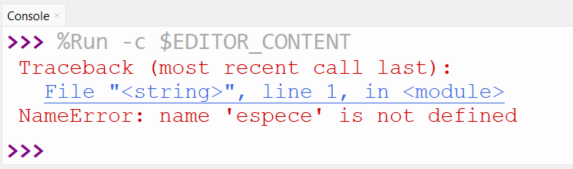

# Révision examen 1


# Section de questions théoriques


### Question 1 

Vrai ou faux?

a) Dans la structure conditionnelle, il est possible d'avoir seulement un if (sans elif ni else).

b) Si on déclare une variable pendant qu'on est dans une fonction, celle-ci ne sera pas utilisable à l'extérieur de la fonction.

c) Le nom de variable "3eVitesse" est valide.

d) Une fonction ne fait rien tant qu'elle n'est pas appelée.


<br>


### Question 2

a) Qu'est-ce qui apparaîtra dans la console si on lance ce bout de code:

```py
poids = 34
poids_lbs = poids*2.2
print("poids_lbs")
```

b) En roulant ce bout de code: 
```py
def fonction(a,b):
    resultat = a * b
    return resultat

print(resultat)

```
on obtient un message d'erreur. Pourquoi?


c) Dans la structure conditionnelle suivante, quelles valeurs de retour aurons-nous (regarder les 3 appels après le code)
```py
def chiffre_mystere(le_chiffre):
    valeur = 0
    if le_chiffre > 0 and le_chiffre < 6:
        valeur = 1
    elif le_chiffre <= 15:
        valeur = 2
    elif le_chiffre == 14:
        valeur = 3
    else:
        valeur = 4
    return valeur

print(chiffre_mystere(2))
print(chiffre_mystere(-10))
print(chiffre_mystere(14))
```

d) À la question précédente, est-ce possible de faire un test pour avoir la valeur 4 en retour? Si oui, donnez un exemple de chiffre à passer à la fonction pour que ça retourne 4, sinon, expliquez pourquoi.

e) Refaire la question c) en changeant le "and" pour un "or". Que constatez-vous?

f) Voici un petit bout de code:
```py
description = espece + couleur
espece = "Chat"
couleur = "noir"

print(description)
```

Expliquez pourquoi vous obtenez cette erreur en rouge dans la console:




g) Dans l'exécution ci-dessous, écrire des numéros à côté des lignes selon l'endroit où est l'exécution. Le numéro 1 est placé pour vous:


<br>
<br>
<br>

# Section de questions de code

Relire ou refaire tous les numéros des notes de cours et du livre:

livre:

- page 27 # 1 à 11
- page 59 # 1-2-3-4-5-8-9-11-12
- page 71 # 1-3-4-5-6-8-9-10

Dans les notes en ligne (github): 

- Semaine 4, tous les numéros
- Semaine 5, tous les numéros
- Examen de l'an passé SAUF Questions 1, 3e), 4a)b)f), 7, 9. Les questions enlevées contiennent des questions sur les variables globales et les paramètres par défaut, que nous n'avons pas vus encore.

<br>
<br>

# Numéros synthèses: 

## Question 3

Écrire une fonction qui prend la taille des 3 côtés d'un triangle et qui retourne le type du triangle: équilatéral, isocèle ou scalène. Un triangle équilatéral a tous les côtés égaux, isocèle a 2 de ses 3 côtés égaux et scalène n'a pas de côtés égaux. Il fut d'abord vérifier si un triangle est plausible: il faut que la somme de 2 des côtés soit supérieur à la longueur de l'autre côté. Tester la fonctions avec minimalement autant de nombres que de possibilités.

<br>
<br>
<br>
<br>

# Solutions

## Question 3

```py
def triangle(a,b,c):
    if a + b > c and a + c > b and b + c > a:
        if a == b and b == c:
            return "équilatéral"
        elif a == b or a == c or b == c:
            return "isocèle"
        else:
            return "scalène"
    else:
        return "Les mesures ne sont pas possibles pour un triangle"

print(triangle(5,5,3))
print(triangle(7,9,12))
print(triangle(7,7,7))
print(triangle(7,9,1))
```