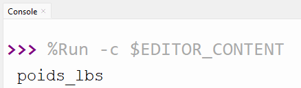
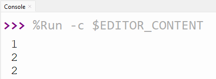

# CORRIGÉ

## Question 1

Vrai ou faux?

a) VRAI.

b) VRAI. (déclaration = la première fois qu'on la nomme)

c) FAUX. un nom de variable ne doit pas commencer par un chiffre. Le V majuscule fonctionne, mais n'est pas dans la convention établie de mettre une barre_soulignée entre les mots

d) VRAI.


## Question 2

a) Puisque le "poids_lbs" est entre guillemets, on va voir juste le mot "poids_lbs" et non ce qu'elle contient.



b) Parce que la variable résultat n'existe pas en dehors de la fonction elle-même, elle a été créée pendant (à l'intérieur de) ladite fonction.


c) On aura les 3 valeurs suivantes



d) Pour avoir 4, on pourrait appeler chiffre_mystere(20) par exemple.

e)

```py
def chiffre_mystere(le_chiffre):
    valeur = 0
    if le_chiffre > 0 or le_chiffre < 6:
        valeur = 1
    elif le_chiffre <= 15:
        valeur = 2
    elif le_chiffre == 14:
        valeur = 3
    else:
        valeur = 4
    return valeur

print(chiffre_mystere(2))  # on a 1
print(chiffre_mystere(-10)) # on a 1
print(chiffre_mystere(14)) # on a 1
```
Les valeurs changent parce que le or laisse passer plus de valeurs que le and. Par exemple, le_chiffre de -10 n'est pas plus grand que 0, mais il est plus petit que 6. Puisque le or ne demande qu'à une des 2 conditions (comparaisons) d'être vraie pour laisser passer, alors la valeur de -10 (et toutes les autres valeurs d'ailleurs) sont attrapées dans le premier if.

f) Erreur parce que la description qui utilise les variables espèce et couleur est déclarée AVANT les variables qu'elle utilise.

g) Voici l'image:


## Question 3

```py
def triangle(a,b,c):
    if a + b > c and a + c > b and b + c > a:
        if a == b and b == c:
            return "équilatéral"
        elif a == b or a == c or b == c:
            return "isocèle"
        else:
            return "scalène"
    else:
        return "Les mesures ne sont pas possibles pour un triangle"

print(triangle(5,5,3))
print(triangle(7,9,12))
print(triangle(7,7,7))
print(triangle(7,9,1))
```

