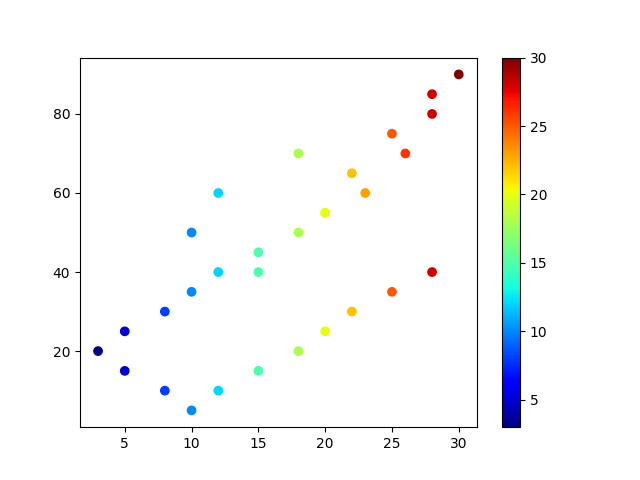

# Graphiques 

# Fonctions théoriques

Tout comme en mathématiques et en physique, on a souvent des modèles théorique à illustrer. Par exemple, la fonction f(x)= 3x+2  ou f(x) = log(x+12) sont des modèles théoriques. On verra comment en étudier le graphique et en retirer des informations.


### Exemple 1:

En premier, faire une fonction pour représenter le graphe. On aura besoin de la fonction à afficher, de valeurs de x, de valeurs de y, de noms pour les axes, un titre

```py
import matplotlib.pyplot as plt
import numpy as np


def f(x):
    return 2 * x

valeurs_x= np.linspace(-10,10)  #Pour générer une liste de valeurs de 
                                    #-10 à 10 en 50 points (valeurs par défaut). 
valeurs_y = f(valeurs_x)  #On appelle la fonction f(x) avec la liste valeurs_x

plt.figure() # utile pour délimiter le début d'un graphique si on a plusieurs graphiques à faire

plt.plot(valeurs_x, valeurs_y, label='f(x)=2x')   #on crée un objet "graphique" (plot)

# Les titres d'axes et le titre
plt.xlabel('x')      #titre de l'axe des x
plt.ylabel('y')      #titre de l'axe des y
plt.xticks([-10,-5,0,5,10])   #graduation de l'axe des x
plt.yticks([-10,-5,0,5,10])   #graduation de l'axe des y
plt.title('Graphique de la fonction f(x) = 2x')

# Ajout des axes plus foncés passant par (0,0)
plt.axhline(0, color='black', linewidth=1.2)
plt.axvline(0, color='black', linewidth=1.2)

# Afficher le graphique
plt.grid(True)   #la commande pour mettre les quadrillages
plt.legend(loc="upper left") #Afficher la légende
plt.show()  #la commande pour afficher le graph
```

### Exercice:

a) Faire le graphe de la fonction  $h(x) = log(x+12)$ ainsi que le graphe de de la fonction  $g(x) = sin(2x-\pi)$ dans la même figure, avec des x allant de -10 à 10 avec 50 points. 

> note, pour faire le sin(x) dans la fonction, utilisez np.sin(x) plutôt que math.sin(x). Pour faire la valeur de pi, faire np.pi aussi

b) Changez les couleurs qui sont mises par défaut, changer aussi le style de ligne et l'épaisseur. Faites en sorte que les limites en x et en y nous permettent de bien voir les 2 fonctions.

c) Mettre une légende en haut à gauche

d) Mettre des limites des valeurs qu'on voit en x et en y pour pouvoir adéquatement voir les 2 fonctions

e) Erreur provoquée: que se passe-t-il si on change la fonction log(x+12) pour log(x+9)?

f) Faites une modification pour que les courbes soient moins saccadées.

# Fonctions empiriques (traits reliant des points)

Si nous souhaitons modéliser des valeurs prises lors d'une expérimentation dans un graphique, il faudra s'y prendre autrement. Au prochain cours, nous verrons comment mettre des valeurs d'un fichier Excel dans une liste. Mais pour l'instant, on fera des listes inventées.

Si, par exemple, vous avez déjà des valeurs de x et de y dans votre expérimentation (le temps avec la hauteur, l'âge avec la masse, le temps avec la concentration d'un produit dans une solution, etc.)

### Exemple 2

Si on fait une expérience à prendre un taux de glycémie à des heures précises, et qu'on veut modéliser le graphique des données:

```py
x = ['8:00','8:07' , '8:12', '8:18', '8:25', '8:32', '8:45']  # Liste pour les valeurs de l'axe des x
y = [80, 100, 105, 110, 120, 118, 118]  # Liste pour les valeurs de l'axe des y
```

Si on souhaite faire un nouveau graphe dans la même page, on doit déclarer un nouveau plt.figure(). On peut mettre tous les détails ajoutés au graphique comme l'exemple précédent.

```py
#Mettre les librairies numpy et matplotlib.pyplot si elles ne sont pas déjà dans votre fichier
plt.figure()
plt.plot(x, y)
plt.show()
```

Modifier le graphique: on souhaite dessiner les taux de glycémie avec des marqueurs ronds, de couleur rouge avec la ligne en tirets. On modifie alors plt.plot(x,y) pour qu'il devienne:

```py
plt.plot(x, y, 'red', linestyle = '--', marker = 'o')
```

# Fonctions empiriques (nuage de points)

Si vous voulez voir la tendance de corrélation entre certains couples de données, il est judicieux de faire un nuage de points. Si on a des listes décrivant des valeurs quelconques et qu'on souhaite en choisir 2 pour faire un nuage de points, voici comment faire:

```py
#Mettre les librairies numpy et matplotlib.pyplot si elles ne sont pas déjà dans votre fichier
temperatures = [10, 12, 15, 18, 20, 22, 25, 28, 30, 28, 26, 23, 20, 18, 15, 12, 
10, 8, 5, 3, 5, 8, 10, 12, 15, 18, 20, 22, 25,28]

precipitations = [50, 60, 40, 70, 55, 65, 75, 80, 90, 85, 70, 60, 55, 50, 45, 
40, 35, 30, 25, 20, 15, 10, 5, 10, 15, 20, 25, 30, 35, 40]

plt.figure()

# Tracé du nuage de points (scatter plutôt que plot)
plt.scatter(temperatures, precipitations)

plt.show()

```

Remarquez l'utilisation de "scatter" plutôt que plot pour regrouper les points. Voici toutes les options de scatter:


### Fonction de nuage de points (scatter)

La fonction scatter() de Matplotlib offre plusieurs options pour personnaliser l'apparence du nuage de points. Voici une liste de quelques-unes des options les plus couramment utilisées :

1. x : Tableau ou séquence des coordonnées x des points.
2. y : Tableau ou séquence des coordonnées y des points.
3. s : Taille des points. Vous pouvez fournir un scalaire pour une taille constante ou un tableau pour des tailles variables.
4. c : Couleur des points. Vous pouvez fournir un seul couleur pour tous les points ou un tableau pour des couleurs variables.
5. marker : Forme du marqueur utilisé pour représenter chaque point (par exemple, 'o' pour un cercle, '^' pour un triangle,'D' pour un losange, etc.).
6. cmap : Carte de couleurs utilisée pour les points si c est un tableau de valeurs numériques (par exemple, 'viridis', 'jet', etc.).
7. alpha : Transparence des points (une valeur entre 0 et 1).
8. linewidths : Épaisseur de la bordure des points.
9. edgecolors : Couleur de la bordure des points.
10. label : Étiquette utilisée pour la légende si vous créez une légende.
11. norm : Normalisation utilisée pour normaliser les valeurs de couleur si c est un tableau de valeurs numériques.
12. vmin, vmax : Valeurs minimale et maximale utilisées pour normaliser les valeurs de couleur si c est un tableau de valeurs numériques.
13. picker : Rayon autour des points dans lequel les événements de sélection sont activés.
14. zorder : Ordre de superposition des points.
15. visible : Indique si les points sont visibles ou non.

Reprenons l'exemple précédent et explorons le jeux de couleur pour avoir le résultat ci-dessous:



Pour réussir ce graphique, il faut fournir une liste de couleurs avec des nombres au paramètre "c" ou "color". Ensuite, il faut choisir une palette de couleur de gradation parmi les suivantes (entre autres):

1. cmap='jet' : Une carte de couleurs arc-en-ciel qui va du bleu au rouge.
2. cmap='hot' : Une carte de couleurs allant du noir au rouge.
3. cmap='cool' : Une carte de couleurs allant du cyan au violet.
4. cmap='spring' : Une carte de couleurs allant du magenta au jaune.
5. cmap='summer' : Une carte de couleurs allant du vert au jaune.
6. cmap='autumn' : Une carte de couleurs allant du rouge à l'orange.
7. cmap='winter' : Une carte de couleurs allant du bleu au vert.

il faut aussi ajouter la colorbar(). En dessous de l'exemple précédent, voici les lignes pour faire ce nuage de points:

```py
plt.figure()

# Tracé du nuage de points
plt.scatter(temperatures, precipitations, c=temperatures, cmap='jet')

plt.colorbar()       

plt.show()

```