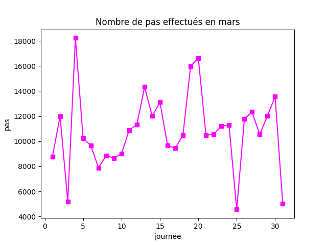

# Exercices graphiques


Avant de débuter, ne pas oublier la commande suivante une fois au début de chaque fichier.

```py
import matplotlib.pyplot as plt
import numpy as np
```
 NOTE IMPORTANTE: il s'agit d'exercices... rien ne va briser si vous testez des choses et expérimentez hors de la question! ;)

## Question 1

Afficher le graphique des fonctions théoriques suivantes:

a) $f(x) = 3x^2 - 19$ en vert en vous assurant que les axes passent par (0,0) et sont en caractère gras et bleus. Le tracé de la courbe doit être en pointillé avec les bouts ronds. Mettre le label "f(x) = 3x^2 - 19" dans la légende. Mettre le titre suivant: "Une superbe fonction" et des titres aux axes (x et y). Les axes doivent aller de -5 à 5.


b) $g(x) = sin(3x)e^{1/x}$ en orange avec une ligne pleine et des axes qui vont de 1 à 50. On ne peut pas commencer à 0 à cause de la division par 0 dans l'exposant de l'exponentielle.

## Question 2

Afficher le graphique des fonctions empiriques suivantes:

Une étudiante décide de noter le nombre de pas qu'elle effectue à chaque jour depuis 1 mois (mars).

 ```py
mes_pas = [8755,12001,5200,18233,10225,9665,7889,8852,8665,9004,10899,11323,14324,12008,13120,9663,9451,10478,15988,16632,10479,10552,11223,11299,4563,11787,12332,10545, 12018,13554,5009]

```
- créer une liste nommée journees qui va de 1 à 31 (pensez à numpy.arange) Essayez de reproduire le graphe ci-dessous:




## Question 3

a) Voici des données récoltées auprès de 20 étudiants universitaires finissants. La première liste représente la moyenne des notes au cégep (sur 100) et la 2e liste montre la moyenne des notes à l'université (sur 4.3)

```py
notes_cegep = [70,80,62,74,87,95,90,77,66,85,75,89,88,62,75,73,89,61,69,92]
notes_uni = [2.3,3.2,1.8,2.1,3.5,3.9,3.6,2.5,2.7,3.0,2.5,3.2,3.0,1.5,1.9,2.1,3.2,2.2,1.9,3.9]
```

Faire le nuage de point des notes à l'université en fonction des notes au cégep. Mettre les points en forme de losanges verts et un grillage en fond. Le titre doit être "Notes à l'uni en fonction des notes au cégep" et les axes doivent avoir le titre approprié aussi.


b) Voici des données récoltées sur le site du guide de l'auto par rapport à la consommation d'essence (en L/100km) et la puissance moteur (en chevaux vapeur) de 24 voitures de type berline.

```py
puissance_moteur = [201,252,241,304,304,153,184,292,175,185,132,330,340,145,268,240,155,329,148,300,268,132,150,240]
consommation_essence = [6.6,7.4,5.9,8.6,8.6,6.4,6.4,7.7,7.0,7.2,6.3,9.6,6.7,6.3,7.5,7.0,5.8,8.5,7.0,7.8,8.4,6.4,5.9,6.7]
```
Faire le nuage de points en mettant les points de format de votre choix de couleurs graduées du bleu au rouge selon la consommation d'essence. Ajuster les titres des axes et le titre principal et mettre un quadrillage.


c) Variante: important pour se rappeler des anciennes notions.

- calculer la moyenne de consommation d'essence et la mettre dans une variable nommée moyenne.
- calculer le max de consommation d'essence et le mettre dans une variable nommée maxi.
- faire une liste vide nommée couleurs.
- parcourir les consommations d'essence. Si elles sont au-dessus de la moyenne, ajouter la moyenne à la liste couleurs. Sinon, ajouter le maxi à la liste de couleur.  


