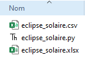
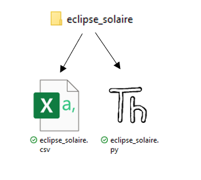
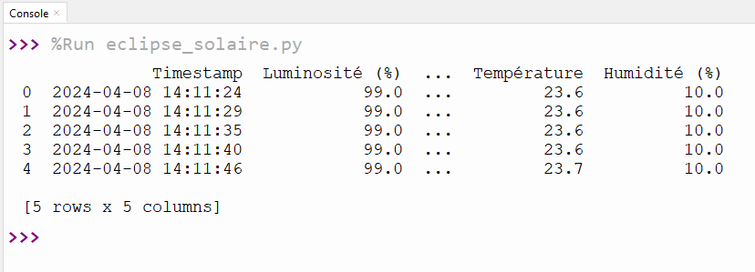
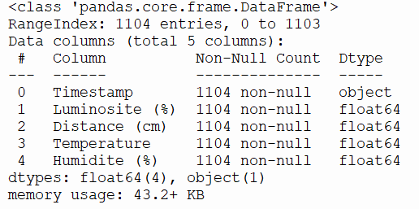
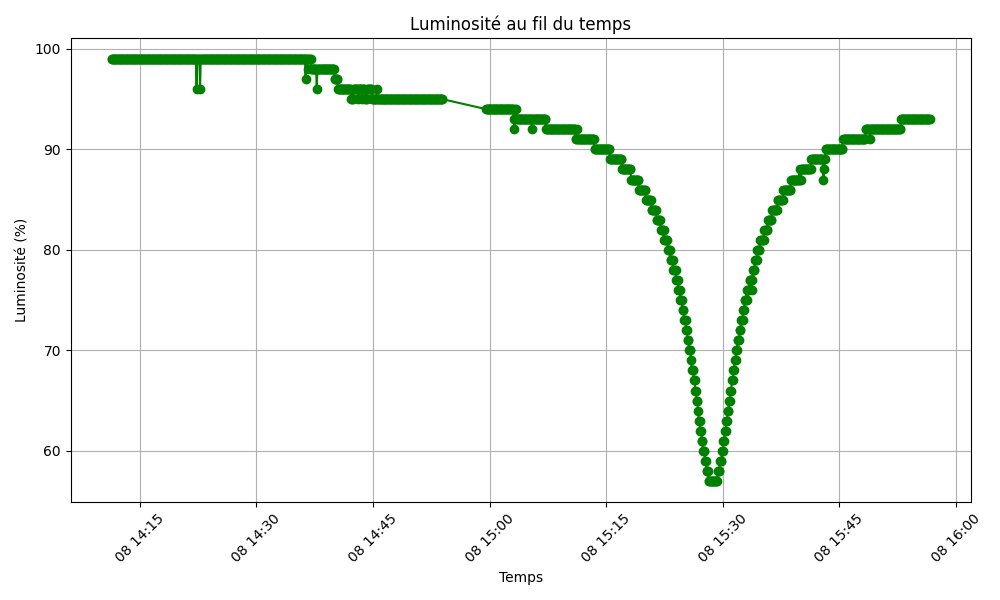

# Importer des données externes 

Note: dans le livre, l'importation de fichiers textes ordinaires (format .txt) est expliqué au chapitre 4.3. Il est nécessaire d'avoir vu le chapitre 3.2 pour y arriver. Nous allons donc explorer une autre façon de faire très intéressante, pour aller chercher de vrais fichiers de données (format csv) et exploiter son contenu.

# Librairie

Pour parvenir a lire très facilement les fichiers .csv, nous aurons besoin de la librairie Pandas
```py
import pandas as pd
```
Si elle n'est pas installée, on procède comme avec numpy ou matplotlib.pyplot:

Outils -> Gérer les paquets -> Pandas ->installer

## Fichiers CSV

Dans le monde de la recherche et des sciences et du partage de données, un format de données très populaire est le .csv, qui ressemble à du Excel, mais qui se lit et se manipule avec d'autres éditeurs que celui de Microsoft (Excel). Les données disponibles sur les sites gouvernementaux, entre autres, sont disponibles en csv.
CSV est l'acronyme de "Comma-Separated Values", ce qui signifie "valeurs séparées par des virgules". Un fichier CSV est un format de fichier texte simple qui stocke des données tabulaires sous forme de texte brut, où chaque ligne du fichier représente une ligne dans la table de données, et les valeurs dans chaque ligne sont séparées par des virgules (ou d'autres délimiteurs comme les points-virgules, les tabulations, etc.).



## Travailler avec un fichier externe

Pour réussir à importer et accéder aux données d'un fichier CSV et ensuite pouvoir déplacer son travail sur un autre ordinateur ou plateforme, il faut que les fichiers soient placés dans le même dossier:




Ensuite, dans votre fichier eclipse_solaire.py, on pourra importer les données:

```py
# Importer la librairie pandas. L'alias utilisé dans la documentation est l'alias pd. 
import pandas as pd

# Lire le fichier CSV. df est un terme utilisé pour datafile. Encoding = "utf-8" est pour s'assurer que les caractères francophones soient pris en charge
data = pd.read_csv("eclipse_solaire.csv", encoding = "utf-8")

# Afficher un résumé des 5 premières lignes
print(data.head())
```

Le résultat est le suivant:



## Fonction courantes de `pandas`

C'est une pratique très répandue d'utiliser la variable de type `dataframe` de `pandas`, `data`, pour appeler les diverses fonctions disponibles dans la librairie:


| Fonction                   | Description                                      |
|:---------------------------|:-------------------------------------------------|
| data.`head()`                  | Affiche les 5 premières lignes du fichier.      |
| data.`tail()`                  | Affiche les 5 dernières lignes du fichier.      |
| data.`info()`                  | Affiche des informations sur le fichier.        |
| data['Nom de la colonne']    | Retourne une colonne du fichier selon son titre.                 |
| data.iloc[:, num_colonne]    | Retourne une colonne du fichier selon son index.                 |

### Exemples:

Si on veut de l'information sur le fichier:

```py
data.info() # data est le nom de la variable qu'on a créée
```
le résultat dans la console:



Si on souhaite lire la colonne de température du fichier csv de l'éclipse solaire et mettre les résultats dans une liste, on pourra faire l'une des commandes ci-dessous:

```py
liste = data['Temperature'].tolist()
#ou bien
liste = data.iloc[:, 3].tolist()   
``` 

### Exercice

Nous allons faire le graphique de la luminosité selon l'heure. Ne pas oublier d'ajouter la librairie pour les graphiques en haut du fichier.

```py
import matplotlib.pyplot as plt
```

1. Mettre les données de la colonne Timestamp dans une liste du nom de votre choix. Les données de temps sont plus complexes, alors voici la commande pour y parvenir:

```py
# Convertir la colonne 'Timestamp' en format datetime
data['Timestamp'] = pd.to_datetime(data['Timestamp']) 
# Mettre les données dans une liste
temps = data['Timestamp'].tolist()
```

2. Mettre les données de la colonne Luminosite (%) dans une liste du nom de votre choix.
3. Maintenant que vous avez 2 listes, faire le graphique de la luminosité en fonction du temps (courbe où les points sont reliés). Voici quelques données intéressantes pour le visuel.

- Ajouter un titre: Luminosité au fil du temps
- Ajouter une étiquette en x: Temps
- Ajouter une étiquette en y: Luminosité (%)
- Ajouter le quadrillage
- Ajouter des graduations (ticks) en x avec un angle de 45:
```py
plt.xticks(rotation=45)
```
- Ajouter la commande ci-dessous pour ajuster et optimiser le chevauchement.

```py
plt.tight_layout()
```
TADAAAAAM!




#### Filtrer les données:

Sur le contenu en chiffre:

```py
# Appliquer un filtre sur les données
data_filtrees = data.query('nom_de_la_colonne > valeur')

# Afficher les données filtrées
print(data_filtrees)
```

Sur le contenu en mot:

```py
# Filtrer les données pour ne garder que les lignes où la colonne contient 'abc'
data_filtrees = data.query('colonne.str.contains("abc", na=False)')  
#na = false c'est pour ne pas considérer les cellules vides

# Afficher les données filtrées
print(data_filtrees)


#Si on a plusieurs valeurs à trier:
data_filtrees = data.query('colonne.str.contains("abc", na=False) or colonne.str.contains("xyz",na=False)')
# na= False est pour éviter que le programme plante si une case contient une donnée qui n'est pas du type voulu.
```

## Exercice en classe

1. Téléchargez le fichier 'normales-mens-1991-2020.csv' à partir du lien suivant: https://www.donneesquebec.ca/recherche/dataset/normales-climatiques-mensuelles/resource/fae9769d-ef7d-4e7f-805f-079ee29cf292

La fiche descriptive des données est ici: https://www.donneesquebec.ca/recherche/dataset/normales-climatiques-mensuelles

2. Trouvez le fichier dans vos dossiers, il sera dans le dossier Téléchargement. Copiez le fichier. Allez dans un autre dossier, là où vous conservez les devoirs du cours de programmation. Créez un nouveau dossier nommé exercice_cours10. Dans ce dossier, collez le fichier 'normales-mens-1991-2020.csv'.

3. Créez-vous une nouvelle feuille Python nommée exercice_cours10.py et enregistrez-la dans le même dossier que le fichier csv.

4. Vous êtes maintenant prêts à travailler sur le fichier à l'aide de Python.

5. Récoltez l'information du fichier avec la commande data.info()

6. On souhaite observer les précipitations de pluie et de neige de 4 stations en Mauricie : 'Shawinigan', 'Trois-Rivières-Aqueduc','Sainte-Anne-de-la-Pérade', 'Charette'. 

7. Le but de cette étape est de faire 3 listes: la pluie et la neige pour seulement les 4 stations de la Mauricie ainsi que les mois associés.


```py
filtre = data.query('NOM_STATION.str.contains("Shawinigan") or NOM_STATION.str.contains("Trois-Rivières-Aqueduc", na=False) or NOM_STATION.str.contains("Sainte-Anne-de-la-Pérade", na=False) or NOM_STATION.str.contains("Charette", na=False)')

liste_pluie = filtre['PLUIE_NORMALE'].tolist()
liste_neige = filtre['NEIGE_NORMALE'].tolist()
liste_mois = filtre['MOIS'].tolist()
```

8. Faites le nuage de points de la pluie (y) par rapport aux mois (x). Il s'agit ici d'un exercice, les détails ne sont pas précisés, on va minimalement mettre un titre, des titres aux axes, modifier la couleur, modifier les marqueurs et mettre le grillage. Pratiquez-vous également à graduer la couleur selon une carte de couleurs.

9. Faites le nuage de points de la pluie par rapport à la neige. Il s'agit ici d'un exercice, les détails ne sont pas précisés, on va minimalement mettre un titre, des titres aux axes, modifier la couleur, modifier les marqueurs et mettre le grillage. Pratiquez-vous également à graduer la couleur selon une carte de couleurs.

10. Faites la moyenne de pluie et affichez-la dans une phrase avec unités de mesure.

11. Trouvez le maximum de neige et affichez-le dans une phrase avec unités de mesure.

12. Trouver le nombre de 0 dans la liste de neige. Truc: pensez à utiliser l'aspect conditionnel des liste Numpy.


