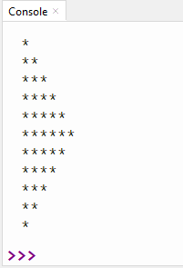

# Exemples de boucles for dans un tableau

**Numéro 1**: 

a) Faire une variable appelée `cumul` qui contient initialement 5.

b) Mettre la liste [1,6,5,1,2,3,8] dans une variable nommée liste1.

c) Faire une boucle qui parcoure la liste1 et qui regarde si l'élément de la liste est pair ou impair. S'il est pair, on l'additionne à `cumul`, s'il est impair, on le soustrait à `cumul`.

d) À la toute fin, on imprime `cumul`.

Corrigé:
```py
cumul = 5
liste1 = [1,6,5,1,2,3,8,9,10,7]

for i in range(len(liste1)):
    if liste1[i] % 2 == 0:
        cumul = cumul + liste1[i]
    else:
        cumul = cumul - liste1[i]

print(cumul)
```

**Numéro 2**: 
a) Mettre la liste [1,6,5,1,2,3,8,9,0,1,4,4,7,12,10,11] dans une variable nommée liste2.

b) Faire une boucle qui parcoure la liste2 et qui, dans le corps de la boucle, vérifie si l'élément de la liste est un nombre pair ou non et qui imprime la réponse à mesure.

c) Calculer combien de nombres il faut croiser avant de rencontrer le 2e multiple de 3.

d) Remplacer tous les multiples de 4 par 0. 

Corrigé:

```py
liste2 = [1,6,5,1,2,3,8,9,0,1,4,4,7,12,10,11]

# c) Calculer combien de nombres il faut croiser avant
# de rencontrer le 2e multiple de 3.
compteur = 0
nombre_multiples_3 = 0

for i in range(len(liste2)):
    compteur = compteur + 1
    if liste2[i] % 3 == 0:
        nombre_multiples_3 = nombre_multiples_3 + 1
        if nombre_multiples_3 == 2:
            break
            print("allo") # pour montrer qu'on ne le verra jamais après un break

# d) remplacer les multiples de 4 par 0
print(f"il a fallu {compteur} nombres croisés pour rencontrer le 2e multiple de 3")
# Remplacer multiples de 4 par 0
for i in range(len(liste2)):
    if liste2[i] % 4 == 0:
        liste2[i] = 0

print(liste2)
```

**Numéro 3**
```py
materiaux = ['Aluminium', 'Fer', 'Cuivre', 'Plomb', 'Or', 'Argent', 'Titane', 'Zinc', 'Nickel', 'Étain']
fusion_celsius = [660.3, 1538, 1084.6, 327.5, 1064.2, 961.8, 1668, 419.5, 1455, 231.9]
```
a) Quelle est la température de fusion du cuivre?

b) Quel est le pourcentage des matériaux ayant une température de fusion inférieure à 500 °C?

c) Combien de matériaux ont une température de fusion inférieure à la moyenne?

d) Combien de matériau faut-il parcourir pour rencontrer le premier qui a une température de fusion supérieure à la moyenne?

e) Créez une liste fusion_kelvin contenant les températures converties en kelvins.
Formule : K = °C + 273.15

f) Créez une liste commentaires contenant des chaînes du type :
"Le <matériau> fond à <température> °C", pour chaque matériau.

Corrigé:
```py
materiaux = ['Aluminium', 'Fer', 'Cuivre', 'Plomb', 'Or', 'Argent', 'Titane', 'Zinc', 'Nickel', 'Étain']
fusion_celsius = [660.3, 1538, 1084.6, 327.5, 1064.2, 961.8, 1668, 419.5, 1455, 231.9]
# a) 
for i in range(len(materiaux)):
    if materiaux[i] == 'Cuivre':
        print(f"La température de fusion du cuivre est {fusion_celsius[i]} Celsius")

# b) Quel est le pourcentage des matériaux ayant une température de fusion inférieure à 500 °C?

compteur = 0

for i in range(len(materiaux)):
    if fusion_celsius[i] < 500:
        compteur += 1
pourcentage = compteur / len(fusion_celsius) * 100

print(pourcentage, "%")


# c) nombre de valeurs inférieures à la moyenne
# Trouver la moyenne avec les boucles
somme = 0
for i in range(len(fusion_celsius)):
    somme = somme + fusion_celsius[i]

moyenne = somme / len(fusion_celsius)
print(moyenne)

nombre_inf_moyenne = 0
# Utiliser la moyenne pour trouver combien il y en a en bas de la moyenne
for i in range(len(fusion_celsius)):
    if fusion_celsius[i] < moyenne:
        nombre_inf_moyenne += 1

print(nombre_inf_moyenne)

# d) Combien de matériau faut-il parcourir pour rencontrer
# le premier qui a une température de fusion supérieure à la moyenne?
compteur = 0
for i in range(len(fusion_celsius)):
    compteur += 1
    if fusion_celsius[i]>moyenne:
        break

print(compteur)

# e) Créez une liste fusion_kelvin contenant les températures converties en kelvins.
# Formule : K = °C + 273.15

fusion_kelvin = []
for i in range(len(fusion_celsius)):
    fusion_kelvin.append(fusion_celsius[i] + 273.15)

print(fusion_kelvin)

```

**Numéro 4**: 

Les chaînes de caractères peuvent aussi être parcourues comme des listes dans une boucle. Voici une liste:
elements_chimiques = ["Hg", "Pb", "As", "Cd", "H2S"]
Voici des équations chimiques. Faire détecter algorithmiquement si les équations contiennent des éléments chimiques de la liste elements_chimiques.
```py
chaine1 = "HgO + 2HCl -> HgCl2 + H2O"
```

Corrigé:
```py
elements_chimiques = ["Hg", "Pb", "As", "Cd", "H2S"]
chaine1 = "HgO + 2HCl -> HgCl2 + H2O"

for i in range(len(elements_chimiques)):
    if elements_chimiques[i] in chaine1:
        print(f"oui, {elements_chimiques[i]} se trouve dans la chaine {chaine1}")
    else:
        print(f"non, {elements_chimiques[i]} ne se trouve pas dans la chaine {chaine1}")

noms = ["Joe", "Cyprien", "Tristan", "Alicia", "Nathan"]
# combien ont un nom qui finit par n
def question1():
    compteur = 0
    for i in range(len(noms)):
        chaine = noms[i]
        if chaine[-1] == 'n':
            compteur = compteur + 1
    print(compteur)

    compteur = 0
    for i in range(len(noms)):
        if noms[i][-1] == 'n':
            compteur = compteur + 1
    print(compteur)
    
question1()
```

**Numéro défi**: 

Faisons une boucle qui dessine un triangle d'étoiles comme ceci:

